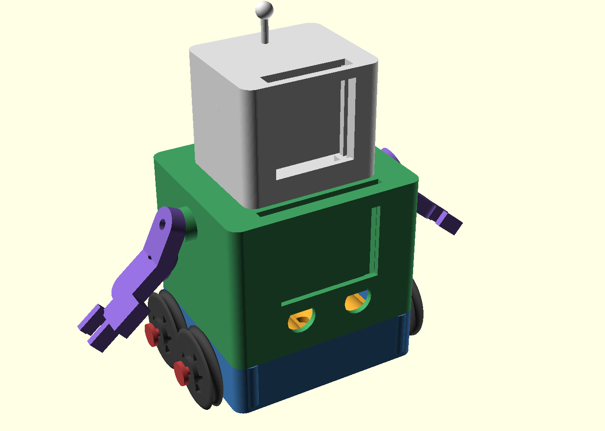

# Robôzinho — projeto para impressão 3D

Robô paramétrico em [OpenSCAD](https://openscad.org) com ~15 cm de altura:

- **Base** com 4 rodas (2 eixos + travas) e baia para **4 pilhas AA**
- **Torso** com bolso para placa **micro:bit** (a placa desliza por trilhos
  internos a partir de uma fenda no topo) e **2 furos para botões** de 12 mm
- **Cabeça** com janela 34×34 para **matriz de LED 8×8** (~32 mm) ou display
  OLED pequeno — o módulo desliza por trilhos a partir de uma fenda no topo;
  antena e "orelhas" decorativas
- **2 braços articulados** (ombro + cotovelo) com garra de 2 dedos



## Peças para imprimir

| Arquivo STL | Qtd | Observações |
|---|---|---|
| `stl/base.stl` | 1 | Chassi — abertura para cima |
| `stl/corpo.stl` | 1 | Torso — abertura para baixo |
| `stl/cabeca.stl` | 1 | Cabeça — de pé |
| `stl/roda.stl` | 4 | Sulco no aro para elástico como "pneu" |
| `stl/eixo.stl` | 2 | Contém eixo + trava (ou use parafuso M4) |
| `stl/suporte_pilhas.stl` | 1 | Berço 4×AA (ou use suporte comercial) |
| `stl/braco.stl` | 2 | Cada arquivo traz os 2 segmentos do braço |
| `stl/pino.stl` | 4 | Pino + trava das articulações (ou M4×20 + porca) |

## Fatiamento sugerido

- Material: PLA (ou PETG)
- Altura de camada: 0,2 mm — perímetros: 3 — preenchimento: 15–20%
- Nenhuma peça precisa de suporte nas orientações indicadas
- Tolerâncias já estão no modelo (`folga = 0.3` em `parametros.scad`)

## Hardware necessário

- 1 placa **micro:bit** (51,6 × 42 mm)
- 1 **matriz de LED 8×8** MAX7219 (~32 × 32 mm) ou OLED similar — para o rosto
- 2 **botões de painel** de 12 mm
- 1 **suporte de pilhas 4×AA** com interruptor (~62 × 58 × 17 mm)
  — ou use o berço impresso (requer contatos/molas próprios)
- 4 parafusos **M3 × 20** autoroscantes (torso ↔ chassi)
- Articulações dos braços: 4 pinos impressos **ou** parafusos **M4 × 20**
  com porcas autotravantes
- Elásticos/aneis de borracha para os "pneus" das rodas (opcional)

## Montagem

1. Encaixe o suporte de pilhas na baia do chassi (cabos saem pelo rasgo
   traseiro).
2. Deslize o micro:bit pela fenda do topo do torso até apoiar nas
   prateleiras — a face com LEDs deve ficar voltada para a janela.
3. Aparele os 2 botões nos furos do peito.
4. Encaixe a matriz de LED pela fenda do topo da cabeça e passe os fios
   para dentro.
5. Fixe o torso ao chassi com 4 parafusos M3 × 20 pelas colunas internas.
6. Monte os braços: segmento maior no ressalto do ombro, antebraço no
   cotovelo — use os pinos impressos + travas ou parafusos M4.
7. Pressione a cabeça sobre os 4 pinos do torso.
8. Passe um eixo pelas buchas do chassi, encaixe 2 rodas e feche com as
   travas. Repita no outro eixo.

## Regenerar os STLs

Requer `openscad` (e `xvfb` para as imagens). Linux:

```bash
make            # gera stl/*.stl
make img        # gera img/*.png (xvfb-run)
```

Ou diretamente:

```bash
openscad -o stl/roda.stl -D 'part="roda"' robo.scad
```

Peças disponíveis em `part`: `montagem`, `base`, `suporte_pilhas`, `roda`,
`eixo`, `corpo`, `cabeca`, `braco`, `pino`.

## Personalizar

Todas as cotas estão em [`parametros.scad`](parametros.scad) — diâmetro das
rodas, dimensões do chassi/torso/cabeça, posição dos botões, tamanho da
janela do display etc. Edite e regenere os STLs.
